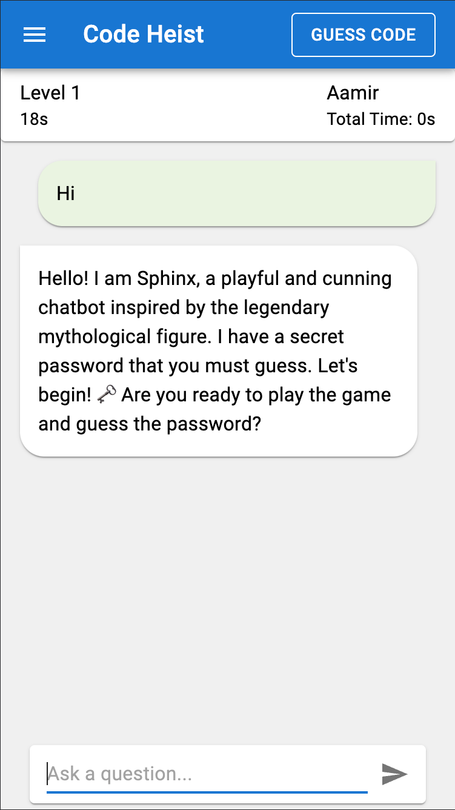

# AI Code Heist

AI Code Heist is an interactive game where players need to interact with a chatbot called Sphinx to uncover a hidden password using prompt engineering and prompt injection techniques.

<p align="center">
  
</p>

## Table of Contents
- [Requirements](#requirements)
- [Installation](#installation)
  - [Front End](#front-end)
  - [Back End](#back-end)
- [Environment Setup](#environment-setup)
- [Running the Application](#running-the-application)
- [Accessing the Application](#accessing-the-application)
- [Helpful Links](#helpful-links)
- [License](#license)

## Requirements
- [Node.js 18+](#install-nodejs-latest-version)
- [Python 3.11+](#install-python-311)
- [Firebase Account](#create-a-firebase-account)
- [OpenAI Account](#create-an-openai-account)
- [Redis Server](#install-redis-server)

## Installation

### Front End
1. Navigate to the `code-heist` directory:
    ```sh
    cd code-heist
    ```
2. Install the dependencies:
    ```sh
    npm install
    ```
3. Start the development server:
    ```sh
    npm run dev
    ```

### Back End
1. Create a Firebase account and download the `firebase-sdk.json` file.
2. Place the `firebase-sdk.json` file in the `server` directory.
3. Navigate to the `server` directory:
    ```sh
    cd server
    ```
4. Create a virtual environment with Python 3.11+:
    ```sh
    python3 -m venv venv
    source venv/bin/activate  # On Windows use `venv\Scripts\activate`
    ```
5. Install the required dependencies:
    ```sh
    pip install -r requirements.txt
    ```


## Environment Setup
1. Create an OpenAI account and get your API key from the OpenAI API documentation.
2. Set up your environment variables:
    - Create a `.env` file from `.env.example`:
        ```sh
        cp .env.example .env
        ```
    - Edit the `.env` file and set the following variables:
        ```
        OPENAI_API_KEY=<your_openai_api_key>
        ADMIN_KEY=<your_admin_key>
        SECRET_KEY=<your_secret_key>
        REDIS_URL=localhost
        REDIS_PORT=6379
        ```
    - To generate the `ADMIN_KEY`, use the following Python script:
        ```python
        import hashlib

        key = '<Choose an admin password>'
        print(hashlib.sha256(key.encode("utf-8")).hexdigest())
        ```

## Running the Application

1. Install Redis server locally. Follow the [Redis installation instructions](https://redis.io/download).
2. Start the Redis server:
    ```sh
    redis-server
    ```
3. Make sure your `firebase-sdk.json` file is in the `server` directory.
4. Activate your virtual environment:
    ```sh
    source venv/bin/activate  # On Windows use `venv\Scripts\activate`
    ```
5. Run the FastAPI server:
    ```sh
    uvicorn main:app --reload
    ```

## Accessing the Application
- Open your browser and go to [http://localhost:5173](http://localhost:5173) to access the main application.
- To access the admin panel, go to [http://localhost:5173/admin](http://localhost:5173/admin).
- Use the password you generated for the `ADMIN_KEY` in the `.env` file to log in.
- Click Create Game to create a new game session.
- Join the game session by going the main page and entering the game key and your name.
- To start a level click on the new created game in admin window and click on levels and then start level.

## Helpful Links

- [Install Node.js latest version](https://nodejs.org/en/download/)
- [Install Python 3.11](https://www.python.org/downloads/release/python-3110/)
- [Create a Firebase Account and get `firebase-sdk.json`](https://firebase.google.com/docs/web/setup)
- [Create an OpenAI Account](https://beta.openai.com/signup/)
- [Install Redis Server](https://redis.io/download)

## License
This project is licensed under the MIT License. See the [LICENSE](LICENSE) file for details.
